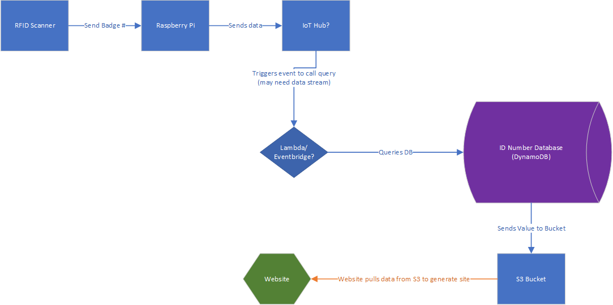

# AttendEase PiCloud
We seek to automate the attendance taking process by allowing students to scan their student ID card upon entering a classroom, sending their name to a web application that shows the teacher a simple list of everyone who's scanned in.

## Who Are We?
 ***Team JZRJ*** (catchy, right?)
 - Jacob Plaziak - *jmplaziak*
 - Zach Redland - *zachary-redland*
 - Richard Phann - *pharicDunwoody*
 - Jake Hochstatter - *FlyxHub*

## Project Blueprint
Most current diagram of what our solution will look like:

## Shopping List
List of things we need to buy for the project:

| Item | Cost |
|-|-|
|Running total | **$0.00** |

## Purchase Orders
Where's our stuff?

|P.O.|Item|Status|
|-|-|-|
|1|[HiLetgo RFID Card Reader](https://www.amazon.com/HiLetgo-125Khz-EM4100-Reader-Swipe/dp/B01MZYYDUV/ref=sr_1_3?keywords=RFID+Readers&qid=1707835660&sr=8-3)|Arrived|N/A|
|1|Mystery NFC Reader|Arrived|
|2|[Raspberry Pi Zero W](https://www.amazon.com/Raspberry-Pi-Zero-Wireless-model/dp/B06XFZC3BX/ref=asc_df_B06XFZC3BX/?tag=hyprod-20&linkCode=df0&hvadid=312363697617&hvpos=&hvnetw=g&hvrand=12255993669550297530&hvpone=&hvptwo=&hvqmt=&hvdev=c&hvdvcmdl=&hvlocint=&hvlocphy=9019669&hvtargid=pla-405706373744&psc=1&mcid=7c324a0a86243324915c51bfb077f963&tag=&ref=&adgrpid=61916342293&hvpone=&hvptwo=&hvadid=312363697617&hvpos=&hvnetw=g&hvrand=12255993669550297530&hvqmt=&hvdev=c&hvdvcmdl=&hvlocint=&hvlocphy=9019669&hvtargid=pla-405706373744&gclid=Cj0KCQiAqsitBhDlARIsAGMR1Rh3R2iQx6Wp9i3mGJZ7Fr_0tgGDG1drqlVJABb0oX2EUVb8bdxf-iMaAvdREALw_wcB)|Arrived|
|2|[SanDisk 32GB MicroSD Card](https://www.amazon.com/SanDisk-Ultra-SDSQUNB-032G-GN3MN-UHS-I-microSDHC/dp/B010NE3QHQ/ref=sr_1_21?crid=2G088BBQ62KN5&keywords=microSD+card&qid=1707407180&s=electronics&sprefix=microsd+card%2Celectronics%2C200&sr=1-21)|Arrived|
|3|Cloud Resources|Arrived|
|4|[Sony RC-S380](https://www.amazon.com/Sony-RC-S380-PaSoRi-Card-Reader/dp/B00VR1WARC)|Arrived|
|5|[USB Hub](https://www.amazon.com/Onfinio-Splitter-Individual-HighSpeed-Extension/dp/B0B7H3D2R9/ref=sr_1_4?crid=1W7FQJTAYW894&dib=eyJ2IjoiMSJ9.Ou3YKRghEbPifAlq6t2fJGLeovmJHVZPBzbHkRhnftqTNeZbrQX6cyLxP9T_cexxpiv41aMQ300v6qEum5paAuTM6J3-c8bFK1aA3gS2LL4HRWcURTT4Y0ljYZecBsx8lRWP2RHuirT3GhLDGJkaBOvQsBXSYhauIiolHiuYrRF-DSIb3jMHfIFqjtGv8KIftDymspLP-2zURr8EGGhwhJC2OiKUYSfyXHtwJItbwOY.QuoDqe_uOIsVXbSyj8hkdblUUhDE3BLIrSzJ_mfc2jI&dib_tag=se&keywords=usb+hub&qid=1710256568&sprefix=usb+hub%2Caps%2C106&sr=8-4)|Arrived|

## To-Do List
What can I be doing right now?

- [x] Get card reader ordered
- [x] Experiment with card reader(s)
  - [X] Write nfcpy script
    - [x] Get script running on Pi
- [x] Research Raspberry Pi
- [x] Order Raspberry Pi
- [x] Configure OS and network on Pi
- [x] Connect Pi to AWS
  - [X] Make AWS pick up ID values
- [X] Setup IAM accounts for team members in AWS environment
- [x] Build DB(s)? (Not really DB but hey it works)
  - [x] Set up S3 bucket
  - [x] Make Athena query S3 bucket
- [X] Build website
  - [ ] Update website with data from S3 bucket
- [ ] Design final blueprint
- [ ] Design and 3D print housing for Pi/reader
- [ ] Present
  - [ ] Slide deck/Demo video?
